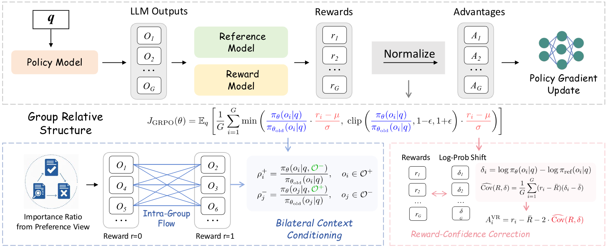

<p align="center">
  <h1 align="center">
  When Right Meets Wrong: Bilateral Context Conditioning with Reward-Confidence Correction for GRPO<br>
  <sub><sub></sub></sub>
  </h1>
  <p align="center">
    <strong>Yu Li</strong><sup>1</sup>
    &nbsp;&nbsp;
    <strong>Tian Lan</strong><sup>1✉</sup>
    &nbsp;&nbsp;
    <strong>Zhengling Qi</strong><sup>2✉</sup>
    <br>
    <sup>1</sup>Department of ECE, George Washington University&nbsp;&nbsp;
    <sup>2</sup>School of Business, George Washington University
    <br>
    <a href='http://arxiv.org/abs/2603.13134'></a>&nbsp;
    <a href='https://github.com/Skylanding/BiCC'></a>&nbsp;
    <br>
    
  </p>
  <br>
</p>

## Abstract
Group Relative Policy Optimization (GRPO) has emerged as an effective method for training reasoning models. While it computes advantages based on group mean, GRPO treats each output as an independent sample during the optimization and overlooks a vital structural signal: the natural contrast between correct and incorrect solutions within the same group, thus ignoring the rich, comparative data that could be leveraged by explicitly pitting successful reasoning traces against failed ones. To capitalize on this, we present a contrastive reformulation of GRPO, showing that the GRPO objective implicitly maximizes the margin between the policy ratios of correct and incorrect samples. Building on this insight, we propose Bilateral Context Conditioning (BICC), a mechanism that allows the model to cross-reference successful and failed reasoning traces during the optimization, enabling a direct information flow across samples. We further introduce Reward-Confidence Correction (RCC) to stabilize training by dynamically adjusts the advantage baseline in GRPO using reward-confidence covariance derived from the first-order approximation of the variance-minimizing estimator. Both mechanisms require no additional sampling or auxiliary models and can be adapted to all GRPO variants. Experiments on mathematical reasoning benchmarks demonstrate consistent improvements across comprehensive models.

## Installation

```bash
git clone https://github.com/Skylanding/BiCC.git
cd BiCC

pip install -e .
pip install -r requirements.txt
pip install vllm
pip install flash-attn --no-build-isolation
```

**Requirements:** Python >= 3.10, CUDA >= 12.1, 8x GPUs.

## Training

### Step 1: Configure Paths

Open `recipe/dapo/run_bicc_dapo.sh` and set the following variables to your local paths:

```bash
export MODEL_PATH="/path/to/your/base_model"   # e.g., Qwen3-4B
export TRAIN_FILE="/path/to/train.parquet"      # training data (parquet with a `prompt` column)
export TEST_FILE="/path/to/val.parquet"         # validation data (same format)
export CKPTS_DIR="/path/to/checkpoints"         # checkpoint output directory
```

### Step 2: Launch Training

```bash
cd BiCC
bash recipe/dapo/run_bicc_dapo.sh
```

The script invokes `python3 -m recipe.dapo.main_refine_dapo` with the full set of Hydra overrides. It will:
1. Initialize Ray and distributed FSDP workers (8 GPUs by default).
2. Run the `RefineDAPOTrainer.fit()` loop: rollout generation → reward computation → BiCC advantage estimation → actor update.
3. Save checkpoints every 50 steps and run validation every 100 steps.
4. Log to both console and Weights & Biases.

### Key Parameters

| Category | Parameter | Value |
|----------|-----------|-------|
| BiCC | `contrastive_grpo.enable` | `True` |
| BiCC | `contrastive_grpo_src.enable` | `True` |
| BiCC | `algorithm.adv_estimator` | `remax` |
| BiCC | `algorithm.kl_penalty` | `0.1` |
| Data | `data.max_prompt_length` / `max_response_length` | `2048` / `3072` |
| Data | `data.train_batch_size` | `16` |
| Data | `actor_rollout_ref.rollout.n` | `8` |
| Optim | `actor.optim.lr` | `1e-6` |
| Optim | `actor.clip_ratio_low` / `high` | `0.2` / `0.28` |
| Rollout | `rollout.name` / `temperature` / `top_p` | `vllm` / `0.2` / `0.7` |
| Trainer | `n_gpus_per_node` / `nnodes` | `8` / `1` |

See `recipe/dapo/run_bicc_dapo.sh` for the complete list of parameters.

## Evaluation

We evaluate on three math reasoning benchmarks: **AIME 2024**, **AIME 2025**, and **MATH-500**.

### AIME 2024

```bash
cd BiCC

python -m evaluation.run_eval \
    --model_path="${CKPTS_DIR}/actor/global_step_XXX" \
    --benchmark=aime24 \
    --output_dir="results/aime24" \
    --temperature=0.6 \
    --top_p=0.95 \
    --n=1 \
    --max_tokens=3072
```

### AIME 2025

```bash
cd BiCC

python -m evaluation.run_eval \
    --model_path="${CKPTS_DIR}/actor/global_step_XXX" \
    --benchmark=aime25 \
    --output_dir="results/aime25" \
    --temperature=0.6 \
    --top_p=0.95 \
    --n=1 \
    --max_tokens=3072
```

### MATH-500

```bash
cd BiCC

python -m evaluation.run_eval \
    --model_path="${CKPTS_DIR}/actor/global_step_XXX" \
    --benchmark=math500 \
    --output_dir="results/math500" \
    --temperature=0.6 \
    --top_p=0.95 \
    --n=1 \
    --max_tokens=3072
```

> Replace `global_step_XXX` with the actual checkpoint step you want to evaluate.

## Project Structure

```
BiCC/
├── data/                    # Training & evaluation data
├── docs/                    # Documentation
├── examples/                # Data preprocessing examples
├── recipe/                  # Training recipes
│   └── dapo/                # BiCC-DAPO recipe
├── scripts/                 # Utility scripts
├── tests/                   # Unit tests
└── verl/                    # verl framework core
```

## Citation

```bibtex
@inproceedings{Li2026WhenRM,
  title={When Right Meets Wrong: Bilateral Context Conditioning with Reward-Confidence Correction for GRPO},
  author={Yu Li and Tian Lan and Zhengling Qi},
  year={2026},
  url={https://api.semanticscholar.org/CorpusID:286519842}
}
```

## Acknowledgements

Built on top of [verl](https://github.com/verl-project/verl) (Volcano Engine Reinforcement Learning for LLMs).

## License

This project is licensed under the [Apache 2.0 License](LICENSE).
